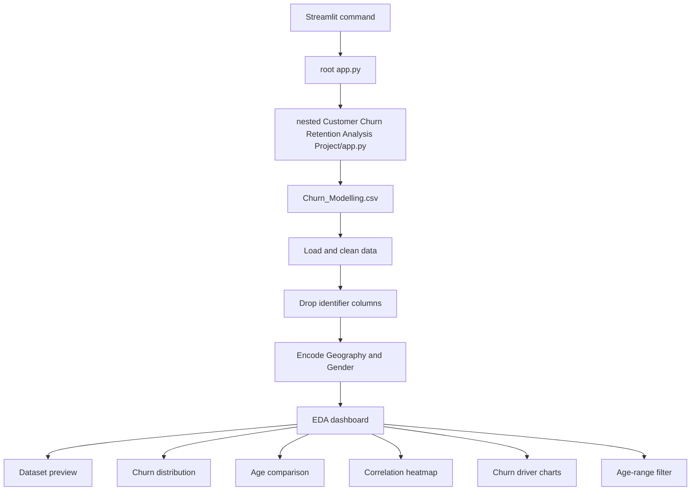

# Customer Churn & Retention Analysis
https://customer-churn-retention-analysis-app.streamlit.app
Interactive customer churn analysis dashboard built with Python, Pandas, Seaborn, Matplotlib, and Streamlit.

## Project Architecture



## Directory Structure

```text
Customer Churn & Retention Analysis Project/
├── app.py                                  # Root Streamlit launcher
├── requirements.txt                         # Pinned Python dependencies
├── README.md                                # Project documentation
├── .venv/                                   # Local Python 3.11 environment (not committed)
└── Customer Churn Retention Analysis Project/
	├── app.py                              # Main dashboard implementation
	├── Churn_Modelling.csv                 # Customer churn dataset
	└── churn_model.ipynb                   # Exploratory analysis and optional model
```

## Application Flow

1. The root `app.py` forwards execution to the nested application file.
2. The dashboard loads `Churn_Modelling.csv` with Pandas.
3. `RowNumber`, `CustomerId`, and `Surname` are removed because they are identifiers, not useful analytical features.
4. `Geography` and `Gender` are converted to numeric dummy variables.
5. Streamlit renders the cleaned data and exploratory visualizations.
6. The age slider filters the data and refreshes the churn distribution chart.

The cleaned dataset is cached with `st.cache_data` so repeated Streamlit reruns do not reload the CSV unnecessarily.

## Dashboard Features

- Dataset preview
- Retained versus churned customer distribution
- Age distribution comparison for churned and retained customers
- Feature correlation heatmap
- Churn rate by active membership
- Churn rate by number of products
- Interactive age-range filtering

## Setup

Create and activate the Python 3.11 environment from this project directory:

```powershell
py -3.11 -m venv .venv
.\.venv\Scripts\Activate.ps1
```

Install dependencies:

```powershell
python -m pip install -r requirements.txt
```

## Run the Dashboard

```powershell
python -m streamlit run app.py
```

Then open `http://localhost:8501` in a browser.

## Notebook

`churn_model.ipynb` contains the supporting analysis workflow:

- Data inspection and missing-value checks
- Churn, age, and geography analysis
- Correlation analysis
- Retention strategy visualizations
- Optional Logistic Regression experiment with a train-test split and classification report

The current Streamlit application is an EDA dashboard. It does not currently expose the notebook's Logistic Regression model as a live prediction endpoint or form.

## Dependencies

The pinned dependencies are listed in `requirements.txt`:

- Streamlit
- Pandas
- Seaborn
- Matplotlib

The notebook's optional modeling section also requires Scikit-learn.
